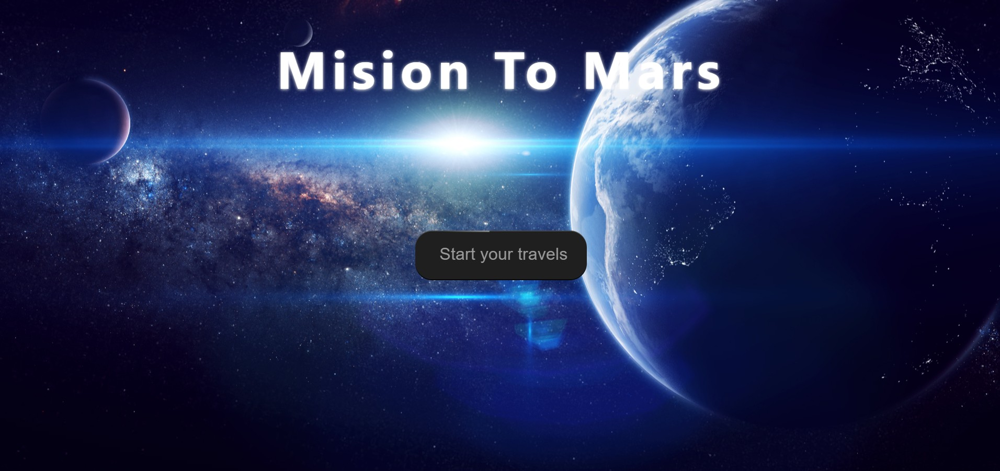

# Portfolio Website  

Dit is mijn persoonlijke **portfolio website** waarin ik mijn projecten, vaardigheden en contactgegevens presenteer. De site is ontworpen met oog voor eenvoud, responsiviteit en een moderne uitstraling.  

## 🌐 Live Demo  
👉 [Bezoek mijn portfolio](https://100536.stu.sd-lab.nl/)  

## 📸 Screenshots  
  
  
  

## ✨ Functionaliteiten  
- **Homepagina** met introductie en welkomstboodschap  
- **Over mij**: korte samenvatting van wie ik ben en mijn opleiding  
- **Projectenpagina**: overzicht van gemaakte projecten met links en afbeeldingen  
- **Contactpagina**:  
  - Contactformulier met velden voor naam, e-mail, onderwerp en bericht  
  - Contactinformatie (e-mail, GitHub, LinkedIn, Instagram)  
- **Loginpagina** (optioneel: toekomstige uitbreiding)  
- **Dark/Light mode switch**  
- **Responsief design**: werkt zowel op desktop als mobiel  

## 🛠️ Gebruikte technologieën  
- **HTML5**  
- **CSS3** (custom styles, grid & flexbox, animaties)  
- **JavaScript (ES6)**: interactieve elementen, dark/light mode  
- **PHP** (voor login/registratie en serverkoppeling, indien actief)  

## 📂 Projectstructuur  

```plaintext
portofolio/
│
├── css/               # Stylesheets (menu.css, foother.css, styles.css, contact.css, etc.)
├── html/              # Pagina’s (about.html, project.html, contact.html, login.html)
├── img/               # Afbeeldingen voor projecten en profiel
├── javascript/        # Script voor dark mode, navigatie, etc.
├── index.html         # Startpagina
└── README.md          # Documentatie

## 📧 Contact  

Wil je contact opnemen of samenwerken? Dat kan via:  

- **E-mail**: [lucas.werk@gmail.com](mailto:lucas.werk@gmail.com)  
- **GitHub**: [github.com/100536](https://github.com/100536)  
- **LinkedIn**: [LinkedIn profiel](https://www.linkedin.com/in/lucas-askamp-87031a2b7/)  
- **Instagram**: [@lucasaskamp](https://www.instagram.com/lucasaskamp/)  
